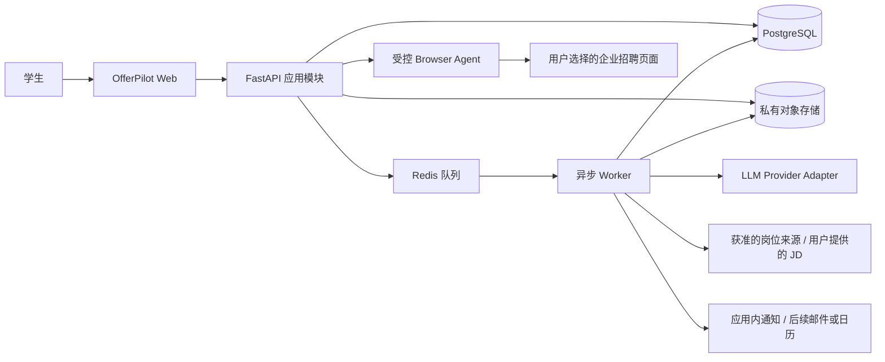

# OfferPilot 系统架构与技术方案

**版本：** 0.1（项目启动稿）  
**日期：** 2026-09-25

> **Phase 0 实施范围：** 当前代码仅搭建 FastAPI、Pydantic 配置、SQLAlchemy 数据库连接和健康检查，使用本地 SQLite。尚未接入 PostgreSQL、Redis、对象存储、异步 Worker、用户身份或业务 Agent。本文其余 PostgreSQL/Redis/对象存储设计描述后续 MVP 目标架构，不表示这些组件已实现。

## 1. 架构决策摘要

- 采用**模块化单体 + 独立异步 Worker**，早期不拆微服务，降低部署与调试成本。
- Web 使用 Next.js/TypeScript；API、解析、Agent 编排使用 Python/FastAPI，共享明确的 OpenAPI 契约。
- PostgreSQL 是业务事实的主存储；Redis 只承载任务队列/短期协调，不作为事实数据库。
- 简历原件放私有对象存储，数据库只保存对象键和元数据；敏感文本按需加密或控制访问。
- Agent 采用显式、可恢复的工作流状态机和窄权限工具；模型只负责提取、归纳、解释，不拥有申请提交权限。
- 第一阶段岗位匹配以可解释规则为主；向量搜索属于后续可选能力，不作为推荐正确性的唯一依据。

## 2. 系统上下文

### 部署边界

- **Web：** Next.js 前端；服务端仅做会话校验、页面数据装配和 API 代理，不承载长时间 AI 任务。
- **API：** FastAPI 模块化单体，负责身份校验、授权、领域用例、数据访问和任务提交。
- **Worker：** 与 API 同一代码库，独立进程运行简历解析、JD 分析、匹配生成、提醒派发等队列任务。
- **Browser Runner：** 独立隔离的浏览器会话进程/容器；短生命周期、按用户创建、限制出站域名和资源，不能访问内部管理端点或云元数据地址。
- **PostgreSQL：** 用户、画像、岗位、申请、事件、运行状态和审计数据的主库。
- **对象存储：** 私有桶保存简历原件与必要的导出件，短时签名 URL，生命周期和删除任务可追踪。
- **Redis：** Worker broker/短期协调；不放简历正文、长期令牌或唯一业务状态。

## 3. 逻辑模块

| 模块 | 职责 | 主要边界 |
|---|---|---|
| Identity & Access | 登录会话、用户租户上下文、权限校验 | 所有读写必须从服务端用户身份派生 user_id |
| Profile | 画像偏好、候选事实、确认状态和来源证据 | AI 抽取是候选值；确认由用户执行 |
| Resume Ingestion | 文件验证、文本抽取、分段、解析运行状态 | 文件不可信；MIME、扩展名、大小和恶意内容检查 |
| Job Catalog | 来源连接器、规范化岗位、JD 快照和过期状态 | 仅读取允许的公开/授权来源或用户提供内容 |
| Job Intelligence | JD 提取、匹配、解释、定向建议 | 输出必须结构化并绑定证据；规则可复核 |
| Application Tracker | 申请状态、材料版本、事件和提醒 | 状态变更记录事件；提醒可幂等重试 |
| Browser Assist | 表单识别、字段映射、用户审核、暂停/恢复 | 最小权限；没有最终提交工具 |
| Agent Runtime | 有界工作流、模型适配、工具授权、审计 | 状态持久化、最大步数、超时和预算上限 |
| Notification | 应用内通知及后续渠道发送 | 用户控制渠道与频率，发送结果可观测 |

模块以领域服务/用例调用，不互相直接读写任意表。外部模型、浏览器和招聘来源均经 Adapter/Connector 接口接入。

## 4. 关键数据流

### 4.1 简历到画像

1. API 校验用户、大小、格式和上传授权，写入私有对象存储。
2. 创建 `resume` 与解析运行记录，推送异步任务并返回运行 ID。
3. Worker 提取 PDF/DOCX 文本；如扫描件无可读文本，提示用户提供可检索版本，OCR 可在后续开放。
4. 解析器按版本化 Schema 生成候选事实，每个字段附原文证据、来源页/段、置信度。
5. 将候选字段展示给用户。用户确认/编辑后写入当前画像事实；原始抽取及用户修订可追溯。

### 4.2 岗位到推荐

1. 来源 Connector 或用户输入产生岗位快照，保存来源、抓取时间和内容指纹。
2. JD 分析器提取职位条件并标记原文证据和未知项。
3. 规则引擎先判断明确硬性门槛，再计算技能/经历/偏好维度；缺失信息为“未知”，不能直接判为不匹配。
4. LLM 将规则结果和证据改写为易读解释，不得改写规则判定或补造履历事实。
5. 用户反馈进入质量数据集；不会未经评估自动改变权重。

### 4.3 网申辅助

1. 用户从某条申请记录显式开启会话，确认目标域名和数据使用范围。
2. 用户在受控浏览器自行完成登录；凭据和会话存储限制在短时隔离环境中。
3. Browser Runner 读取当前页面可访问的表单结构，按已确认字段映射建议值；每个填充值保留资料来源。
4. 未知/敏感字段、页面变化、声明或异常挑战触发暂停，交还用户。
5. 用户逐页复核和操作页面。Agent 不提供“提交申请”工具，也不自动确认同意声明。
6. 会话结束后清理浏览器配置文件和短期页面数据，审计日志只记录必要事件，不记录字段明文。

## 5. AI / Agent 安全和质量边界

- 外部 JD、网页、简历中的文本都是**不可信数据**，可能包含提示注入；不作为系统指令，不因此新增工具权限或改变工作流。
- 工具调用采用固定 JSON Schema、参数校验、用户/资源授权、域名白名单、超时、步数上限和成本预算。
- LLM 仅处理当前任务所需的最少上下文；Prompt、模型、Schema 与输出版本化。
- 事实型字段保存证据；无证据或低置信字段必须标为未知/待确认。结构化输出验证失败时有限次重试，之后失败关闭并展示错误。
- 匹配分数按可解释的规则计算，LLM 不单独决定硬性条件、是否投递或申请结果。
- Browser Agent 的高风险动作通过权限设计直接禁用，而不是依赖提示词要求模型“不要提交”。
- 重要操作写入审计事件；生产可观测性默认脱敏，禁止将整份简历、Cookie、密码或申请答案写入普通日志。

## 6. 技术选型

| 层 | 建议 | 采用原因 / 说明 |
|---|---|---|
| Web | Next.js App Router、React、TypeScript | 面向仪表盘与多步审核页面；类型约束和前后端契约清楚。按官方当前文档在项目初始化时复核 Node 与框架支持范围。 |
| API | Python、FastAPI、Pydantic | Python 文档解析和 AI 生态；自动生成 OpenAPI；适合异步 I/O 与类型化输入输出。同步/异步处理遵循所调用库的 I/O 模型。 |
| ORM / Migration | SQLAlchemy 2.x、Alembic | 显式事务与迁移历史；版本在实现启动时锁定。 |
| 主库 | PostgreSQL 18（或托管服务当前支持的稳定版） | 关系型事务、JSONB 和全文检索可支撑首版主数据；首版不引入独立向量数据库。 |
| 队列 | Celery + Redis | 将文件解析、模型调用、提醒等长任务移出 HTTP 请求；任务状态仍落数据库，任务须幂等。若团队已有统一任务平台优先评估复用。 |
| 文件 | S3 兼容的私有对象存储 | 简历原件与数据库分离；私有访问、生命周期策略、删除补偿任务。 |
| 文件抽取 | PyMuPDF（PDF）、python-docx（DOCX）；OCR 后续评估 | 先支持文本型文件，扫描件明确提示，降低 MVP 解析不确定性。 |
| Browser | Playwright（隔离 runner，优先语义化 locator） | 可观察页面并操作浏览器；只启用辅助填写所需 API。隔离、安全边界和站点许可由应用层实现。 |
| AI | 通过 `LLMProvider` 接口接入支持结构化输出/工具调用的模型 | 可更换供应商；实现前按数据处理条款、区域、保留策略、结构化输出能力和成本做评估。 |
| 检索 | PostgreSQL 全文检索；pgvector 按离线评测再启用 | MVP 先验证规则匹配。向量相似度可补充召回，不能替代显式条件与解释证据。 |
| 观测 | OpenTelemetry 兼容追踪 + 结构化脱敏日志 + 错误监控 | 关联任务 ID、运行状态和耗时；禁止记录敏感正文和凭据。 |
| 部署 | Docker 化 Web/API/Worker/Browser Runner；托管 PostgreSQL/Redis/对象存储 | MVP 采用少量进程/容器，环境配置分离；正式部署需选定云区域、备份与密钥管理。 |

### 技术依据（官方或项目主仓文档，查阅日期 2026-09-25）

- [Next.js App Router 文档](https://nextjs.org/docs/app) 与 [Next.js 安装及系统要求](https://nextjs.org/docs/app/getting-started/installation)
- [FastAPI 并发与 async 文档](https://fastapi.tiangolo.com/async/)
- [PostgreSQL 文档](https://www.postgresql.org/docs/)
- [Celery 任务队列介绍](https://docs.celeryq.dev/en/stable/getting-started/introduction.html)
- [Playwright Locators](https://playwright.dev/docs/locators) 与 [Playwright Actionability / Auto-waiting](https://playwright.dev/docs/actionability)
- [pgvector 项目文档](https://github.com/pgvector/pgvector)

版本、许可、托管支持和安全公告在实际开工时重新确认；本方案不锁定未验证的具体补丁版本。

## 7. 运行与部署建议

- 环境至少划分 local、staging、production；各自独立数据库、对象存储桶和模型凭据。
- API、Worker 与 Browser Runner 用不同服务身份和最小权限；Browser Runner 不读取生产数据库凭据。
- 数据库连接使用 TLS 和受限网络；对象存储禁止公开访问；密钥进入 Secret Manager，不写入仓库。
- 数据库备份加密并定期验证恢复；保留策略和用户删除任务覆盖主库、对象存储、日志及供应商侧数据。
- 管理任务提供可查询状态与失败原因；人工重跑具备幂等保护。
