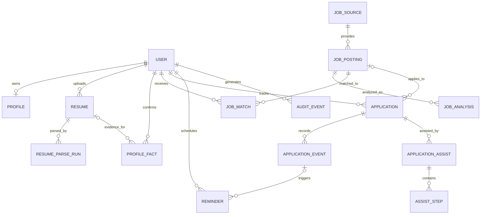

# OfferPilot 数据库设计

**版本：** 0.3（目标逻辑模型 + Phase 1-1/1-2 实现说明）

**日期：** 2026-09-25

## 当前实现：Phase 1-1 ～ Phase 1-2

本阶段按当前任务建立三张 SQLite 表，并通过 Alembic 初始迁移创建；下文第 1～4 节仍是后续 MVP 的目标逻辑设计，两者尚未完全一致。

| 已实现表 | 核心字段 | 关系 |
|---|---|---|
| `resume_documents` | UUID `id`、`file_name`、`file_path`、`file_type`、可空 `raw_text`、`created_at` | 一个简历文档最多有一个画像 |
| `profiles` | UUID `id`、`resume_id`、可空的 `name` / `phone` / `email`、JSON `education` / `skills` / `projects` / `internships`、`created_at` | `resume_id` 唯一且指向简历文档；一个画像可有多个事实 |
| `profile_facts` | UUID `id`、`profile_id`、`field_name`、JSON `value`、`confidence`、`source_text`、`created_at` | `profile_id` 指向画像；`confidence` 限制在 0～1 |

删除简历文档时，数据库级外键和 ORM 关系会级联删除其画像及事实；`file_path` 指向的实际文件不由数据库删除。Phase 1-2 的 `POST /resume/upload` 将通过验证的 PDF 原件保存在本地 `backend/uploads/`，提取出的可选中文本写入 `raw_text`。解析或数据库保存失败时会尝试移除本次上传的文件。当前没有画像字段解析流程。

**数据边界：** `raw_text`、联系方式和证据片段属于敏感个人信息。本阶段将原件保存在本地文件系统、文本保存在本地 SQLite；尚无用户归属字段、租户授权、字段加密、正式保留/导出/删除流程，因此上传接口只在 `development` 环境启用，仅用于本机开发和合成样本，不应用真实用户简历或向外提供服务。后续引入用户系统时，需以迁移增加用户归属和数据生命周期能力，再开放给真实用户。SQLite 的 `created_at` 使用 UTC `CURRENT_TIMESTAMP`，但自身不保留时区信息。

## 1. 设计原则

- PostgreSQL 保存业务事实和工作流状态；简历原件存私有对象存储，数据库保留对象键。
- 所有用户数据表带 `user_id` 或通过受约束的父关系归属用户；查询必须校验当前身份，不能信任客户端传入的 `user_id`。
- 使用 UUID 主键、UTC `timestamptz`、外键和必要的唯一约束；高频列表索引以 `(user_id, created_at)` 等访问模式设计。
- 解析、匹配、建议均是有版本的结果快照；用户修改和 AI 候选结果分开存，避免覆盖已确认事实。
- 简历、邮箱、电话、答案等敏感字段最小化收集；加密/访问控制和删除政策作为字段设计的一部分。
- JSONB 用于版本化的模型输出或低频扩展属性；稳定查询字段应保持关系列，不把全部业务实体塞进 JSON。

## 2. ER 关系

## 3. 核心实体

字段为逻辑设计，具体列类型、命名与加密实现由迁移定义。

### 3.1 `users`

| 字段 | 含义 |
|---|---|
| `id` | UUID 主键 |
| `auth_subject` | 身份提供方中的不可变用户标识，唯一 |
| `email` | 可选，若业务需要则加密或以受控方式存储 |
| `created_at`, `updated_at`, `deleted_at` | 生命周期时间；删除流程状态 |

索引/约束：`UNIQUE(auth_subject)`；如按邮箱查找，使用规范化且受保护的索引策略。

### 3.2 `profiles`

一用户一条当前画像偏好，不承载简历原件。

字段：`id`, `user_id UNIQUE`, `target_roles`, `preferred_locations`, `work_types`, `graduation_year`, `salary_preference`（可选）, `preferences JSONB`, `created_at`, `updated_at`。用户可修改偏好；偏好与履历事实分开。

### 3.3 `resumes`

字段：`id`, `user_id`, `object_key`, `original_filename`（安全清洗）, `mime_type`, `byte_size`, `sha256`, `status`, `uploaded_at`, `deleted_at`, `retention_until`。对象键不可由客户端指定；下载用短时签名 URL。

索引：`(user_id, uploaded_at DESC)`；限制单文件大小、MIME allowlist；文件哈希仅在用户范围内用于重复检测。

### 3.4 `resume_parse_runs`

每次抽取/解析运行一条，方便重跑和追溯。

字段：`id`, `resume_id`, `user_id`, `status`, `parser_version`, `model_provider`, `model_name`, `schema_version`, `started_at`, `finished_at`, `error_code`, `metrics JSONB`（仅脱敏信息）。不将完整提示词、简历正文放到普通日志。

### 3.5 `profile_facts`

画像字段的候选、确认值和来源记录；教育、技能、项目、经历可统一按字段路径表示，后续稳定后再按查询需求拆分子表。

字段：`id`, `user_id`, `field_key`, `value JSONB`, `normalized_value`（可选）, `status`（`candidate` / `confirmed` / `rejected` / `superseded`）, `source_type`（resume/user/manual/import）, `resume_id NULL`, `evidence_text`, `evidence_location JSONB`, `confidence`, `confirmed_by_user_at`, `supersedes_fact_id NULL`, `created_at`。

约束：`confidence` 在 `[0,1]`；已确认字段需记录确认时间；`evidence_text` 仅保存完成解释所需的最短片段。对当前有效字段建立部分索引，不能通过非唯一约束误覆盖历史记录。

### 3.6 `job_sources` 与 `job_postings`

`job_sources`：`id`, `name`, `source_type`, `base_domain`, `terms_url`, `access_policy`, `enabled`, `rate_limit_config JSONB`, `created_at`。只由管理员维护允许的来源策略。

`job_postings`：`id`, `source_id NULL`, `external_id NULL`, `canonical_url`, `company_name`, `title`, `location`, `employment_type`, `description_snapshot`, `content_hash`, `posted_at NULL`, `deadline_at NULL`, `first_seen_at`, `last_seen_at`, `status`, `normalized_fields JSONB`, `created_at`, `updated_at`。

约束/索引：来源 ID 存在时可对 `(source_id, external_id)` 建部分唯一索引；内容指纹用于去重但不替代岗位身份。URL 必须经 SSRF/域名策略验证。敏感页面/用户私有内容不能意外变成共享岗位快照。

### 3.7 `job_analyses`

字段：`id`, `job_posting_id`, `analysis_version`, `schema_version`, `required_qualifications JSONB`, `preferred_qualifications JSONB`, `skills JSONB`, `responsibilities JSONB`, `unknowns JSONB`, `evidence_map JSONB`, `model_metadata JSONB`, `created_at`。

同一岗位可以保存多个版本；旧分析作为审计/对比快照，不静默覆盖。证据需引用岗位快照中的原文区段。

### 3.8 `job_matches`

用户与岗位的匹配快照。

字段：`id`, `user_id`, `job_posting_id`, `analysis_id`, `profile_revision`（或事实集合版本标识）, `rule_version`, `dimension_scores JSONB`, `decision_labels JSONB`, `strengths JSONB`, `gaps JSONB`, `unknowns JSONB`, `recommendation`, `explanation`, `feedback NULL`, `created_at`。

分数需与维度、规则版本一起解释；不得只保留不可复算的总分。用户反馈与原结果关联并允许后续重算。

### 3.9 `applications`

字段：`id`, `user_id`, `job_posting_id NULL`, `custom_job_snapshot JSONB NULL`, `status`, `applied_at NULL`, `next_action_at NULL`, `notes`, `created_at`, `updated_at`, `archived_at NULL`。

状态：`preparing`, `submitted`, `assessment`, `interview`, `offer`, `rejected`, `withdrawn`, `closed`。建议保留 `job_posting_id` 可空，以支持手动申请记录。

索引：`(user_id, status, updated_at DESC)`、`(user_id, next_action_at)`。

### 3.10 `application_events` 与 `reminders`

`application_events`：`id`, `application_id`, `user_id`, `event_type`, `title`, `starts_at NULL`, `deadline_at NULL`, `timezone`, `details`, `source`, `created_at`, `updated_at`, `completed_at NULL`。事件类型含截止日、笔试、面试、自定义下一步、状态变更。

`reminders`：`id`, `user_id`, `event_id NULL`, `application_id NULL`, `channel`, `scheduled_at`, `status`, `idempotency_key UNIQUE`, `attempt_count`, `sent_at NULL`, `last_error_code NULL`, `created_at`。派发任务重复执行不得重复通知。

### 3.11 `application_assists` 与 `assist_steps`

`application_assists`：`id`, `user_id`, `application_id`, `target_domain`, `status`, `started_at`, `expires_at`, `ended_at`, `policy_version`, `browser_profile_ref`（短时引用，不是持久凭据）, `stop_reason`。

`assist_steps`：`id`, `assist_id`, `sequence_no`, `page_fingerprint`, `action_type`, `field_key NULL`, `profile_fact_id NULL`, `result`, `user_reviewed_at NULL`, `created_at`。不得存密码、Cookie、完整 DOM 快照或敏感字段明文；排障时采用用户明确同意的短时脱敏采样。

### 3.12 `audit_events`

记录登录、数据导出/删除、画像确认、Browser Agent 启停/暂停、关键设置变化等安全相关事件。

字段：`id`, `user_id NULL`, `actor_type`, `action`, `resource_type`, `resource_id`, `request_id`, `metadata JSONB`（字段 allowlist + 脱敏）, `created_at`。审计访问本身受限，按保留策略轮换。

## 4. 数据生命周期与安全

- 上传对象使用私有存储和随机对象键；仅经鉴权 API 发放短时下载链接。
- 原始简历、解析文本、候选事实、AI 派生数据均列入用户导出/删除清单。
- 软删除用于可恢复的短暂删除窗口；最终清除需覆盖对象存储、数据库副本/索引及适用的供应商侧数据，并有删除任务状态。
- 删除账户时先阻止新任务，撤销会话/短期 Browser Runner，再清理文件、事实、岗位个人关联、申请、提醒和派生数据；不可避免的备份保留需按备份周期过期。
- 对敏感值采用字段级加密或可靠托管数据库加密；应用层密钥存 Secret Manager，支持轮换。
- PostgreSQL Row Level Security 可作为纵深防御评估项，但应用服务端授权仍必须执行。
- 数据保留天数、供应商处理条款、数据区域和用户同意文案在上线前确定，不能仅靠数据库默认值代替产品政策。
