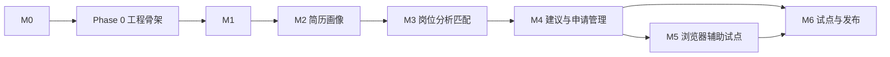

# OfferPilot 开发路线图

**版本：** 0.1（按交付里程碑规划，不绑定日历日期）  
**日期：** 2026-09-25

## 1. 交付策略

先完成可信的画像与岗位决策闭环，再开放浏览器辅助。每个里程碑都可演示、可验收；Browser Agent 先限制到明确允许的单一网站/流程，验证安全和稳定后再扩展。上线范围以 PRD 的 P0 和每阶段验收条件为准。

## 2. 里程碑

### M0：产品与工程准备

**交付：** PRD、架构、数据库、开发规则；确认目标用户、部署地区、身份方案、模型供应商数据策略、首批岗位来源、试点招募方式。

**验收：** P0 流程和不做事项经团队评审；来源许可和个人数据处理策略有明确责任人；确定试点指标及数据删除/导出要求。

### Phase 0：MVP 工程骨架（当前实施）

**交付：** `backend/`、`frontend/`、`docs/`、`tests/` 基础目录；Python 3.11 后端包；FastAPI 启动入口与健康检查；Pydantic Settings 配置；SQLAlchemy + SQLite 连接与 Session；依赖锁文件。

**范围边界：** 不包含用户系统、Redis、PostgreSQL、Browser Agent、简历解析或前端页面。

**验收：** 可按运行说明启动 API；`/health` 能检查 SQLite 连接；`.env`/环境变量配置可用；依赖由锁文件固定。

### M1：核心基础设施与安全

**交付：** 在 Phase 0 骨架上完善前端、API、Worker 本地运行环境；接入 PostgreSQL/Redis/对象存储；实现身份认证、租户授权、数据库迁移、任务状态、日志脱敏、CI 和 staging。

**验收：** 用户之间无法互读数据；上传文件仅私有访问；异步任务可查询、重试且幂等；密钥不进入仓库或日志。

### M2：简历导入与画像确认

**交付：** PDF/DOCX 文本抽取、画像字段 Schema、候选事实及证据展示、编辑/确认/拒绝、导出/删除基础流程。

**验收：** 支持文件类型和失败路径清楚；用户能找到每项抽取证据并修正；未经用户确认的字段不会成为已确认事实；删除任务覆盖原件和派生数据。

### M3：岗位目录、JD 分析与匹配

**交付：** 粘贴 JD 和岗位链接输入；首批经过审核的公开/授权来源；岗位规范化、分析快照、规则匹配、证据化解释与反馈入口。

**验收：** 明确区分满足/部分满足/无证据/不满足；未知条件不被伪装成负面事实；匹配解释引用画像和 JD；来源、时间和更新状态可见。

### M4：简历建议、申请看板与提醒

**交付：** 目标岗位简历建议、用户编辑/复制；申请状态、事件、应用内提醒、提醒失败重试。

**验收：** 每条建议能追溯到 JD 和画像证据且不生成新事实；状态变化留有时间记录；时区和重复派发处理正确；用户可暂停提醒。

### M5：受控 Browser Agent 小范围试点

**交付：** 独立隔离 Browser Runner、一个允许测试的招聘站点适配器、字段映射预览、逐页确认/暂停/停止、会话过期和审计记录。

**验收：** 凭据由用户自行输入，不持久化；站点/页面变化时失败关闭；未知字段不自动填写；页面声明和最终提交都由用户处理；没有任何 Agent 提交工具；可终止并清理会话。

### M6：封闭试点、质量改进与正式发布

**交付：** 小规模学生试点、质量评审、错误反馈闭环、成本与延迟仪表板、备份恢复演练、隐私流程审查、发布/回滚手册。

**验收：** 达到 PRD 的试点护栏；未授权提交为 0；画像抽取、匹配解释、提醒和删除流程达到可接受质量；高优先级缺陷关闭；支持团队有故障排查路径。

## 3. 工作流依赖

M5 不应成为验证核心价值的前置条件；M2–M4 可先形成可用的求职管理闭环。发布门槛仍需包含 P0 中约定的 Browser Agent 受控试点策略，团队可根据合规与站点接入条件调整发布日期。

## 4. 需要尽早验证的风险

| 风险 | 验证方式 | 决策点 |
|---|---|---|
| 简历格式差异导致字段误抽 | 用脱敏并获授权的多样样本测字段精确率、证据定位和人工修正成本 | 先支持文本 PDF/DOCX；是否需要 OCR |
| 匹配分数造成虚假确定感 | 与学生和职业顾问评审解释；观察不同专业/年级的反馈 | 分数是否显示、权重是否可配置 |
| 岗位来源许可与数据新鲜度 | 逐个审核来源的条款、可用 API/feed、更新频率和去重效果 | 首发连接器白名单 |
| Browser Agent 页面易变且含恶意内容 | 使用隔离测试站点和少量允许站点验证字段检测、暂停和清理 | 每站点支持范围及停用条件 |
| 简历及网申信息泄露 | 数据流盘点、供应商处理条款审查、访问/删除演练 | 可用模型、部署区域、保留配置 |
| AI 成本和延迟不可控 | 记录每条任务 token/耗时/重试和失败类别，设置预算与缓存策略 | 模型路由与额度 |

## 5. 团队交付节奏建议

- 每个里程碑先写可验证的用户场景和接口/数据契约，再实现垂直切片。
- 每周演示真实流程，优先观察用户是否理解证据和“未知”状态。
- 对 LLM 结果保留版本化离线评测样本；线上只采集必要的脱敏反馈。
- Browser Agent 独立发布开关和站点白名单；任一站点适配异常可单独停用。
- 上线前完成数据导出/删除、队列积压、模型不可用、来源失效、浏览器中断的演练。
